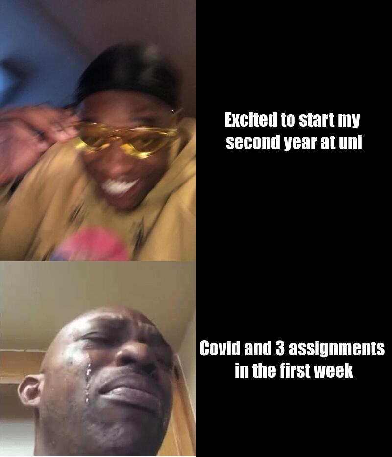

# *Daniel Perkins stats 220 Assignment 1 Part 1*
## **Coding for my meme**
``` 
library(magick)

#\n for break in text line

#panel 1
Excited_Man <- image_read("https://i.kym-cdn.com/photos/images/newsfeed/001/553/696/a42.jpg") %>%
  image_scale(400)


#panel 2
happy_text <- image_blank(width = 400, height = 534, color ="#000000") %>% 
  image_annotate(text = "Excited to start my \nsecond year at uni",
                 color = "#FFFFFF",size = 37, font = "Impact", gravity = "center") 


#panel 3 
crying_man <- image_read("https://newfastuff.com/wp-content/uploads/2019/02/PMU2Xjq.png") %>%
  image_scale(400)


#panel 4
sad_text <- image_blank(width = 400, height = 400, color ="#000000") %>% 
  image_annotate(text = "Covid and 3 assignments \nin the first week",
                 color = "#FFFFFF",size = 37, font = "Impact", gravity = "center")


#combining 
happy_vector <- c(Excited_Man, happy_text)
First_row <- image_append(happy_vector)

sad_vector <- c(crying_man, sad_text)
second_row <- image_append(sad_vector)

#final
Meme <- c(First_row,second_row) %>%
  image_append(stack = TRUE) %>%
  image_scale(800)

Meme

image_write(Meme, "My_Meme.png")
```

## **My Meme produced:**


## Meme information and inspiration
During the time i was creating this meme, i was having a **extremley stressful** week, mostly due to the fact that i had to miss out on some lectures due to my newly contracted Covid. When we were assigned this task, i thought it would be funny to create a meme that is niche, yet may also be relatable to some fellow second year university students.
The format i used is a bit of a "classic" 4 panel format with the left hand side depicting two emotions, and the right hand side giving an explanation for said emotions. My twist is that i chose two custom images of my liking which make me laugh whenever i see them used in other formats. The bottom left image is actually sourced from a 
viral video, however due to course language and use of an illegal substance, i feel it would be unwise to link it in a university assignment. Instead I will show an example of it as one of my favourite [gifs](https://c.tenor.com/do8q_eYrsW4AAAAC/crying-black-guy-meme.gif) to use when messaging my mates.
